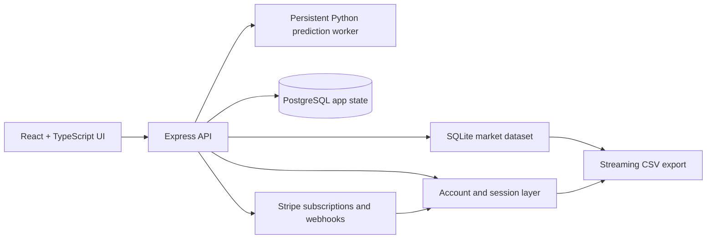

# AutoValuePredictor

**Private-source full-stack vehicle valuation and market-data platform**

AutoValuePredictor turns used-car listing data into a consumer valuation workflow
and a subscription-based research product. I built it to connect machine learning,
data engineering, secure payments, and practical automotive decision support in one
production-oriented application.

> The production source, trained model artifacts, customer data, and full market
> dataset are private. This case study documents the system and verified engineering
> outcomes without exposing proprietary implementation details.

## Product

The public experience is designed around a short valuation funnel:

1. Enter make, model, year, mileage, fuel type, and condition.
2. Receive a central estimate, practical price range, and pricing context.
3. Refine the estimate with optional trim, equipment, title, and history details.
4. Continue to an approved selling partner or a paid market-data workflow.

The paid research plan provides account-bound, streaming CSV exports with daily
fair-use limits. Access is revoked when a subscription is cancelled or becomes
past due.

## Architecture

## Engineering Highlights

- Built a React/Vite valuation experience with responsive forms, market snapshots,
  result explanations, and account workflows.
- Integrated a Python/scikit-learn serving path behind a persistent worker protocol
  instead of interpolating request values into shell commands.
- Added strict input validation and regression tests for oversized and malicious
  payloads.
- Bound paid access to authenticated accounts and server-side subscription state,
  never to a client-supplied subscription identifier.
- Implemented signed, idempotent Stripe webhook handling for activation,
  cancellation, duplicate delivery, and failed-payment suspension.
- Converted large dataset exports to streaming CSV and added durable per-account
  daily quotas.
- Made expensive market-stat refreshes asynchronous with cache-miss deduplication.
- Kept large databases, trained models, customer state, and all secrets outside Git.

## Verified Scale and Quality

| Area | Evidence |
|---|---|
| Market data | Production workspace contains more than **1.1 million** normalized vehicle listings |
| Development data | Representative **100,000-row** private sample used for local integration checks |
| Automated tests | **25 passing** local Python tests; live service suites are opt-in |
| Prediction safety | Worker protocol tests cover malformed JSON, oversized payloads, range validation, and code-injection attempts |
| Export security | Tests cover authentication, subscription entitlement, traversal rejection, quotas, and non-package data isolation |
| Performance tooling | Concurrent prediction and market-refresh smoke scripts report latency, HTTP failures, and timeout behavior |
| Build quality | TypeScript check and production client/server build pass |

No model-accuracy percentage is published here because deployment calibration and
real-world holdout reporting must be completed before that claim would be defensible.

## Technology

React 18 · TypeScript · Vite · Tailwind CSS · TanStack Query · Express ·
PostgreSQL · SQLite · Stripe · Python · scikit-learn · pandas · joblib · pytest

## Source Protection

The private repository excludes:

- production SQLite databases and raw/training CSV files
- trained `.joblib` model artifacts and feature metadata
- customer, session, subscription, and purchase state
- environment files, API keys, webhook secrets, and password hashes

A separate public case study is intentional: it demonstrates product and
engineering judgment while keeping the revenue-generating implementation and data
private.

## Current Status

The core application, payment access controls, streaming export path, and local
build/test gates are implemented. Production deployment is being finalized with a
stable public domain, encrypted runtime secrets, Stripe test-mode lifecycle
validation, and full-data smoke testing.
